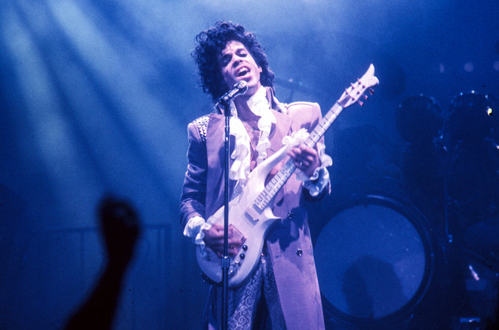

#Text mining with R: Prince lyrics

All the credit goes to Debbie Liske who wrote [a blog](https://www.datacamp.com/community/tutorials/R-nlp-machine-learning)
upon which these notes are based. I have changed some code to simplify it and to try and imbed it in the Tidyverse as much as possible. 

Check out this book: [Text Mining with R](https://www.tidytextmining.com)

##Introduction
From an [article in The Guardian](
https://www.theguardian.com/music/2015/may/19/new-study-reveals-lyric-intelligence-getting-lower)

>Is lyrical intelligence getting lower? A new study suggests the complexity of lyrics is declining, comparing words used in songs to reading levels in US schoolchildren ("Hip-hop ain't top: new study reveals reading levels behind music lyrics". The Guardian 19/5/15)

One can use text mining, NLP, machine learning and other data science methods to shed insight into "lyrical intelligence" and also to identify themes that appeal to society based on how well a song is received, and, perhaps, predict whether a song will do well based on lyrical analysis alone.

##Prince



To celebrate the inspiring and diverse body of work left behind by Prince, you will explore some of the sometimes obvious, but often hidden, messages in his lyrics. However, you don't have to like Prince's music to appreciate the influence he had on the development of many genres globally. Rolling Stone magazine listed Prince as the 18th best songwriter of all time, just behind the likes of Bob Dylan, John Lennon, Paul Simon, Joni Mitchell and Stevie Wonder. Lyric analysis is slowly finding its way into data science communities as the possibility of predicting "Hit Songs" approaches reality.

>Prince was a man bursting with music - a wildly prolific songwriter, a virtuoso on guitars, keyboards and drums and a master architect of funk, rock, R&B and pop, even as his music defied genres. (New York Times)

##Questions of interest

Before diving in, think about what you're trying to discover. You will first walk through an analysis of the dataset. What does it look like? How many songs are there? How are the lyrics structured? How much cleaning and wrangling needs to be done? What are the facts? What are the word frequencies and why is that important? From a technical perspective, you want to understand and prepare the data to apply techniques such as sentiment analysis, NLP, and machine learning models.

##Prepare to work in R

Load the following libraries.  Please, remember to install the packages before loading the libraries if you haven't installed them yet.

```{r}
library(readr)# read text files
library(dplyr) #data manipulation
library(stringr)#manipulate strings
library(ggplot2) #visualizations
library(gridExtra) #viewing multiple plots in a grid
library(tidytext) #text mining
library(wordcloud2) #creative visualizations
```

##Reading in the data

Read in the data with information about Prince's authored songs, including their lyrics.

```{r message=FALSE}
prince_orig = read_csv("prince_raw_data.csv")
names(prince_orig)
```

In `prince_orig`:

- `X`: a row number

- `text`: song lyrics. 

The other columns include song, year, and peak (which shows its placement on the Billboard charts). US.Pop and US.R.B are peak chart positions for the US (Pop and R&B charts). Drop all the other columns. Rename some columns.
We use `%>%`, which is the piping operator. It passes on the output of the function on its left to the arguments (inputs) of the function on its right.

```{r}
#choose some columns and rename some of them
prince = prince_orig %>% 
  select(lyrics = text, song, year, album, peak, us_pop = US.Pop, us_rnb = US.R.B)
```         

Let us obtain some general descriptors of the data.

```{r}
summary(prince)
```  
  
There are 37 years of songs, 1978 to 2015, and the lowest charted song (that exists in the dataset) is at position 88. You can also see 
that there are quite a few NAs for year and peak.


Let us further inspect the data by looking at the 139th row, with info about the song "controversy".
```{r}
glimpse(prince[139,])
```
```{r}
nrow(prince)
```
Prince was a prolific song writer: 824 songs.

Let us look at how the lyrics data is structured. For song 139, "controversy"
```{r}
str(prince[139, ]$lyrics, nchar.max = 300)
```


##Song trends across time  
Create a `decade` column

```{r}
#create the decade column
prince = prince %>%
  mutate(decade = 
           ifelse(prince$year %in% 1978:1979, "1970s", 
           ifelse(prince$year %in% 1980:1989, "1980s", 
           ifelse(prince$year %in% 1990:1999, "1990s", 
           ifelse(prince$year %in% 2000:2009, "2000s", 
           ifelse(prince$year %in% 2010:2015, "2010s", 
                  "NA"))))))  
```
  
Now, create `chart_level`, which represents whether a song peaked in the Top 10, Top 100, or did not chart (that is, uncharted). These are mutually exclusive, so Top 100 does not include Top 10 songs.

```{r} 
#create the chart level column
prince <- prince %>%
  mutate(chart_level = 
           ifelse(prince$peak %in% 1:10, "Top 10", 
           ifelse(prince$peak %in% 11:100, "Top 100", "Uncharted")))
```

In addition, create a binary field called `charted` indicating whether a song reached the Billboard charts or not (that is, a popular song).

```{r}
#create binary field called charted showing if a song hit the charts at all
prince <- prince %>%
 mutate(charted = ifelse(prince$peak %in% 1:100, "Charted", "Uncharted"))

#save the new dataset to .csv
write.csv(prince, file = "prince_new.csv")
```  


##Song Stats

Using `dplyr`'s functions `filter()` (to select rows), `group_by()` (to group data by values of a categorical variable),  `summarise()` and `n()` (counts the number of entries of a vector), you can group by decade and then count the number of songs. Then, using `ggplot()` with the geometry `geom_bar()`, create a bar chart and fill the bars with the charted category.

```{r}
aux = prince %>%
  filter(decade != "NA") %>%
  group_by(decade, charted) %>%
  summarise(number_of_songs = n())
aux
```
```{r}
  ggplot(aux, aes(x = decade, y = number_of_songs, fill = charted)) + 
  geom_bar(stat = "identity")  +
  ggtitle("Released Songs") +
  labs(x = NULL, y = "Song Count")
```

This clearly shows Prince's most active decade was the 1990s.

Now create a similar graph with `chart_level`.
Remember to group_by() both decade and chart_level so you can see the trend.
In this graph, you'll only look at charted songs so filter out everything else using peak > 0. Pipe the group_by object into summarise() using n() to count the number of songs. As you store this in a variable, you can pipe that to ggplot() for a simple bar chart.

```{r}
charted_songs_over_time = prince %>%
  filter(peak > 0) %>%
  group_by(decade, chart_level) %>%
  summarise(number_of_songs = n())
charted_songs_over_time
```

```{r}
  charted_songs_over_time %>% 
  ggplot(aes(x = decade, y = number_of_songs, fill = chart_level)) + 
  geom_bar(stat = "identity") +
  labs(x = NULL, y = "Song Count") +
  ggtitle("Charted Songs")
```

Notice that out of all Prince's charted songs, the majority reached Top 10. But what is even more interesting is that his most prolific decade for new songs was the 1990s, yet more chart hits occurred in the 1980s. 

In order to use the power of the full dataset for lyrical analysis, you can remove references to chart level and release year and have a much larger set of songs to mine. Take a look:
```{r}
#look at the full data set at your disposal
prince %>%
  group_by(decade, chart_level) %>%
  summarise(number_of_songs = n()) %>%
  ggplot(aes(x = decade, y = number_of_songs, 
               fill = chart_level)) +
  geom_bar(stat = "identity")  +
  labs(x = NULL, y = "Song Count") +
  ggtitle("All Songs in Data")
```

##Text Mining

Text mining can also be thought of as text analytics. The goal is to discover relevant information contained in text. 

Natural Language Processing (NLP) is one methodology used in mining text. It tries to decipher the ambiguities in written language by tokenization, clustering, extracting entity and word relationships, and using algorithms to identify themes and quantify subjective information. 

Begin by breaking down the concept of lexical complexity.
Lexical complexity can mean different things in different contexts, but for now, assume that it can be described by a combination of measures such as

-Word Frequency: number of words per song

-Word Length: average length of individual words in a text

-Lexical Diversity: number of unique words used in a text (song vocabulary)

-Lexical Density: the number of unique words divided by the total number of words (word repetition)
Tidy Text Format

To begin the analysis, we need to

- Clean the data.

- Break out the lyrics into individual words, a process called **tokenization**.

Once the two steps are carried out, we can start mining for insights.

##Data Formats and Tokenization

There are different methods and data formats that can be used to mine text. We will use
"Tidy Text", a table with one token (word) per row.

**Tokenization is the process of splitting the lyrics into tokens. We will use the function `unnest_tokens()` in `tidytext`  to do this.**

##Cleaning the lyrics data

One of the first tasks in text analysis is to clean up the text. Only meaningful, real words should be retained for analysis.

###Expand contractions such as won't, can't, etc.

```{r}
  prince$lyrics = str_replace_all(prince$lyrics, "won't", "will not")
  prince$lyrics = str_replace_all(prince$lyrics, "can't", "can not")
  prince$lyrics = str_replace_all(prince$lyrics, "n't", " not")
  prince$lyrics = str_replace_all(prince$lyrics, "'ll", " will")
  prince$lyrics = str_replace_all(prince$lyrics, "'re", " are")
  prince$lyrics =  str_replace_all(prince$lyrics, "'ve", " have")
  prince$lyrics = str_replace_all(prince$lyrics, "'m", " am")
  prince$lyrics = str_replace_all(prince$lyrics, "'d", " would")
  # 's could be 'is' or could be possessive: it has no expansion
  prince$lyrics = str_replace_all(prince$lyrics, "'s", "")
```  

###Remove special characters

<!-- selecting items with [^...] gives out an inverted character list, matches any characters except those inside the square brackets.-->

```{r}
#remove special characters: remove everything except the letters a to z, A to Z, and the numbers 0 to 9
prince$lyrics = str_replace_all(prince$lyrics, "[^a-zA-Z0-9 ]", " ")
```

###Convert all letters to lower case with the `tolower()` function.

```{r}
# convert letters to lower case
prince$lyrics <- tolower(prince$lyrics) 
```

Let us inspect row 139 again

```{r}
str(prince[139, ]$lyrics, nchar.max = 300)
```


##Tokenizing

To break lyrics into individual words, use the `tidytext` library. 

We need to both break the text into individual tokens (tokenization) and transform it to a tidy data structure. 

The function `unnest_tokens()`, useful to tokenize, requires at least two arguments: the output column name that will be created as the text is unnested into it (`word`, in this case), and the input column that holds the current text (i.e. `lyrics`).

After the lyrics text has been tokenized, one must do some further cleaning. 

1. So called "stop words" must be removed.
Stop words are overly common words that may not add any meaning to results. There are different lists to choose from, but here you'll use the lexicon called `stop_words` from the `tidytext` package.

We can use `sample()` to show a random list of these stop words and `head()` to limit the output to 15 words.

```{r}
head(sample(stop_words$word, 15), 15)
```

So, after tokenizing the lyrics into words, you can then use dplyr's `anti_join()` (`anti_join(x, y)` returns all rows from x where there are not matching values in y, keeping just columns from x) to remove stop words. 

2. Next, get rid of the undesirable words that were defined earlier. 

Many lyrics, when transcribed, include phrases like "Repeat Chorus", or labels such as "Bridge" and "Verse". There are also a lot of other undesirable words that can muddy the results. Based on prior analysis, a list of superfluous words was made

```{r}
undesirable_words = c("prince", "chorus", "repeat", "lyrics", 
                       "theres", "bridge", "fe0f", "yeah", "baby", 
                       "alright", "wanna", "gonna", "chorus", "verse", 
                       "whoa", "gotta", "make", "miscellaneous", "2", 
                       "4", "ooh", "uurh", "pheromone", "poompoom", "3121", 
                       "matic", " ai ", " ca ", " la ", "hey", " na ", 
                       " da ", " uh ", " tin ", "  ll", "transcription",
                       "repeats")
```                       
                       
                       

3. Get rid of any duplicate records as well. 

4. Remove all words with fewer than four characters. This is another subjective decision, but in lyrics, these are often interjections such as "yea" and "hey". 

Store the results into `prince_words_filtered`.

**Note**: `prince_words_filtered` is the tidy text version of the prince data frame without 1) stop words, 2) undesirable words, and 3) 1-3 character words. 


```{r}
#tokenize and remove stop, undesirable and short words
prince_words_filtered = prince %>%
  unnest_tokens(word, lyrics) %>% # tokenizing
  anti_join(stop_words) %>% #removing stop words
  distinct() %>% #eliminate duplicate rows
  filter(!word %in% undesirable_words) %>% #remove undisarable words
  filter(nchar(word) > 3) # remove short words
```

```{r}
names(prince_words_filtered)
```
```{r}
nrow(prince_words_filtered)
```

Here is a snapshot of `prince_word_filtered`: just 10 rows where `word` is "race".
This shows the tokenized, unsummarized, tidy data structure.

```{r}
prince_words_filtered %>% 
  filter(word == "race") %>% #keep rows where `word`="race"
  select(word, song, year, peak, decade, chart_level, charted) %>%
  arrange() %>% #sort in alphabetical order of `song` 
  top_n(10,song) #top 10 rows
```


##Word Frequency

In music, individual word frequencies carry a great deal of importance, whether it be repetition or rarity. Both affect memorability of the entire song itself. One question a songwriter may want to know is if there is a correlation between word frequency and hit songs. So now you want to take the tidy format one step further and get a summarized count of words per song.


To examine this format in Prince's lyrics, create a histogram showing the distribution of word counts, grouped by song, per placement on the Billboard Charts. Unnest the prince lyrics again without filtering any words (stop, undesirable or short words) to get a true count of word frequency across songs. Again use group_by() and summarise() to get counts. Then use the dplyr verb arrange() to sort by count. First, take a look at the highest counts, then use ggplot() for the histogram.
                  
```{r}                  
full_word_count <- prince %>%
  unnest_tokens(word, lyrics) %>%
  group_by(song,chart_level) %>%
  summarise(num_words = n()) %>%
  arrange(desc(num_words)) 

full_word_count[1:10,]
```                  

```{r}
names(full_word_count)
```


```{r message=FALSE, warning=TRUE}
full_word_count %>%
  ggplot(aes(x = num_words, fill = chart_level )) +
    geom_histogram() +
    ylab("Song Count") + 
    xlab("Word Count per Song") +
    ggtitle("Word Count Distribution")
```


##Top Words

In order to do a simple evaluation of the most frequently used words in the full set of lyrics, you can use `count()` and `top_n()` to get the n top words from your clean, filtered dataset. Then use `reorder()` to sort words according to the count and use `dplyr`'s `mutate()` verb to reassign the ordered value to word. This allows `ggplot()` to display it nicely.

```{r}
aux = prince_words_filtered %>%
  count(word, sort = TRUE) %>% #the output has 2 columns word and n (the counts of each word)
  top_n(10) %>% #select the 10 top rows
  ungroup() %>%
  mutate(word = reorder(word, n))

aux
```
```{r}
  ggplot(aux, aes(x = word, y = n)) +
    geom_col(fill = "pink") +
    theme(legend.position = "none", 
          plot.title = element_text(hjust = 0.5),
          panel.grid.major = element_blank()) +
    xlab("") + 
    ylab("Song Count") +
    ggtitle("Most Frequently Used Words in Prince Lyrics") +
    coord_flip()
```

As in most popular music, love seems to be a common topic. 

Now, let us have some visual fun.


#Word Clouds

Word clouds get a bad rap in many circles, and if you're not careful with them, they can be used out of context where they are not appropriate. However, by nature, we are all very visual beings, and there are cases where real insight can be gained. Just use them with a grain of salt.

But for now, take a look at a new package called `wordcloud2` for some cool stuff. This package gives you a creative collection of clouds that generate html widgets. You can actually hover over a word to see its frequency in the text. (This package can be slow to render in rMarkdown and is often picky about the browser it uses. Hopefully improvements will be made.)

```{r}
prince_words_counts <- prince_words_filtered %>%
  count(word, sort = TRUE) 
```

```{r}
wordcloud2(prince_words_counts[1:300, ], size = .5)
```

```{r}
wordcloud2(prince_words_counts[1:300, ], size = .5, ellipticity = 0.9)
```

```{r}
wordcloud2(prince_words_counts[1:300, ], size = .7, backgroundColor = "grey")
```

```{r}
wordcloud2(prince_words_counts[1:300,], size = 1)
           
```


Purple was Prince's favourite colour.

```{r}
wordcloud2(prince_words_counts[1:300,], shape = "star", size = 0.3, color = "purple")
```


